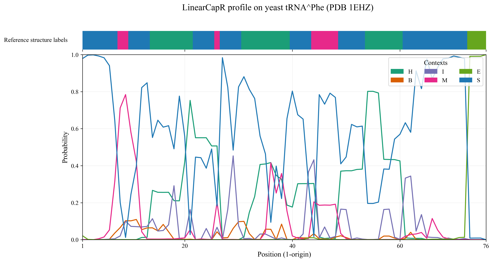

# LinearCapR

LinearCapR computes per-nucleotide structural-context probabilities for RNA in
practical linear time using beam-pruned dynamic programming. Unlike
span-limited approximations, it does not impose a base-pair span cutoff, so
long-range interactions can be retained.

For each nucleotide, LinearCapR reports posterior probabilities for six local
structural contexts:

- Stem (`S`)
- Hairpin loop (`H`)
- Bulge loop (`B`)
- Internal loop (`I`)
- Multiloop (`M`)
- Exterior loop (`E`)

The output format is compatible with CapR-style structural profiles, so it can
be dropped into existing downstream pipelines that expect per-position context
probabilities.

## Quick Start

Build the binary and run it on the bundled example FASTA:

```bash
make
./LinCapR test.fa test.profile 100
head -n 8 test.profile
```

Print the ensemble free energy as well:

```bash
./LinCapR test.fa test.profile 100 -e
```

Use the Turner 1999 energy model instead of the default Turner 2004 model:

```bash
./LinCapR test.fa test.profile 100 --energy turner1999
```

## What LinearCapR Outputs

LinearCapR writes one sequence block at a time:

1. Sequence name (the FASTA header without `>`)
2. Six profile lines, one for each context

The contexts always appear in the following order:

1. `Bulge`
2. `Exterior`
3. `Hairpin`
4. `Internal`
5. `Multiloop`
6. `Stem`

Each line contains one probability per nucleotide. For every position `i`,

```math
p_S(i) + p_H(i) + p_B(i) + p_I(i) + p_M(i) + p_E(i) = 1
```

A typical output block looks like:

```txt
example_seq
Bulge 0.80 0.75 0.10 0.05 0.02
Exterior 0.05 0.10 0.60 0.10 0.05
Hairpin 0.05 0.05 0.10 0.60 0.10
Internal 0.05 0.05 0.10 0.10 0.60
Multiloop 0.05 0.05 0.10 0.15 0.23
Stem 0.00 0.00 0.00 0.00 0.00
```

The numeric values above are illustrative, but the label order and file layout
match the real output format.

## Representative Example

As a compact qualitative example, the figure below shows a LinearCapR profile
on yeast phenylalanine tRNA (PDB: 1EHZ), together with reference structure
labels derived from the same sequence. This is the same type of
profile-to-structure correspondence used in the major-revision manuscript to
help interpret what the six context probabilities represent in practice.



## Build

### Requirements

- C++17 compiler such as `clang++` or `g++`
- `make`
- Standard C++ STL / libc
- `python3` + `matplotlib` only if you want to use the optional plotting utility

### Compilation

```bash
make
```

This produces the executable `LinCapR` in the repository root.

## Usage

```bash
./LinCapR <input_fasta> <output_file> <beam_size> [options]
```

Arguments:

- `input_fasta`: FASTA file containing one or more RNA sequences
- `output_file`: path to the output profile file
- `beam_size`: beam width used for pruning

Options:

- `-e`: print ensemble free energy (`G_ensemble`) to standard output
- `--energy turner2004`: use Turner 2004 parameters (default)
- `--energy turner1999`: use Turner 1999 parameters

Notes:

- Multiple FASTA entries are processed sequentially and appended to the same
  output file.
- Sequence characters should be standard RNA bases (`A`, `C`, `G`, `U`).
- Non-canonical characters are treated conservatively as unpaired input.
- `beam_size = 0` disables beam pruning and is only practical for short
  sequences because runtime and memory grow much more quickly.

## Recommended Beam Sizes

The best beam size depends on sequence length and available memory.

- Short RNAs (up to about 1 kb): `50` is often sufficient; use `100` if you
  want a stronger accuracy setting.
- Medium RNAs (about 1 to 10 kb): `100` is a good default.
- Long RNAs / viral genomes (about 10 to 30 kb): `100` to `200` is usually a
  reasonable range.
- Very long RNAs: start around `50` to `100` and increase only if memory
  allows.

If you are unsure, start with:

```txt
beam_size = 100
```

and adjust upward for accuracy or downward for speed and memory.

## Minimal Examples

Run the default model:

```bash
./LinCapR test.fa test.profile 100
```

Run Turner 1999:

```bash
./LinCapR test.fa test_turner1999.profile 100 --energy turner1999
```

Run with ensemble free energy output:

```bash
./LinCapR test.fa test.profile 100 -e
```

Plot an existing profile file:

```bash
python3 plot_profile.py --profile test.profile --output-prefix docs/test_profile
```

Run LinearCapR from a FASTA file and plot in one step:

```bash
python3 plot_profile.py --fasta test.fa --output-prefix docs/test_profile
```

## Repository Layout

- `main.cpp`: command-line entry point
- `LinCapR.cpp`, `LinCapR.hpp`: main algorithm implementation
- `test.fa`: bundled example input
- `compare_profiles.py`: helper for comparing two output profile files
- `plot_profile.py`: optional plotting utility for LinearCapR profiles

## Reproducing Paper Figures

This repository contains the core LinearCapR implementation. The manuscript
figures, large-scale benchmark outputs, and figure-generation scripts are kept
separately in the computational experiments repository:

- https://github.com/TakumiOtagaki/LinearCapR_ComputationalExperiments

If you want to reproduce the graphs and tables from the paper, start there.

## Notes on the Algorithm

- LinearCapR uses a beam-pruned inside-outside dynamic program over a CapR-like
  stochastic context-free grammar for pseudoknot-free RNA secondary structures.
- The grammar truncates long unpaired runs in loops using a fixed cap
  (`C = 30` by default), which was chosen to cover the overwhelming majority
  of multiloop unpaired runs in bpRNA-1m(90).
- Dynamic programming values are accumulated in log space using a numerically
  stable log-sum-exp approximation.

Algorithmic details and pseudocode are described in the LinearCapR manuscript
and Supplementary Information.

## Citation

If you use LinearCapR in published work, please cite:

```bibtex
@ARTICLE{Otagaki2025-cu,
  title       = "{LinearCapR}: Linear-time computation of per-nucleotide
                 structural-context probabilities of {RNA} without base-pair
                 span limits",
  author      = "Otagaki, Takumi and Hosokawa, Hiroaki and Fukunaga, Tsukasa and
                 Iwakiri, Junichi and Terai, Goro and Asai, Kiyoshi",
  journal     = "bioRxiv",
  institution = "bioRxiv",
  pages       = "2025.12.26.696559",
  month       = dec,
  year        = 2025,
  language    = "en"
}
```

## Contact

For questions, bug reports, or feature requests, please open an issue in this
repository or contact the corresponding author:

- Takumi Otagaki: takumiotagaki@gmail.com
